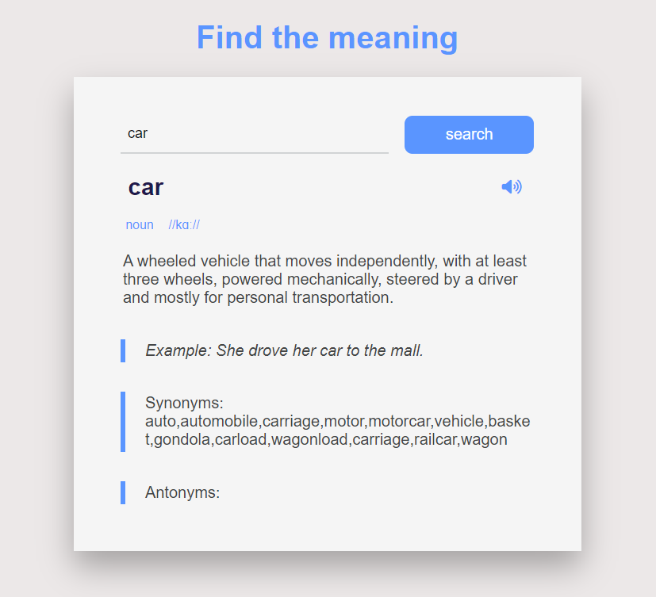
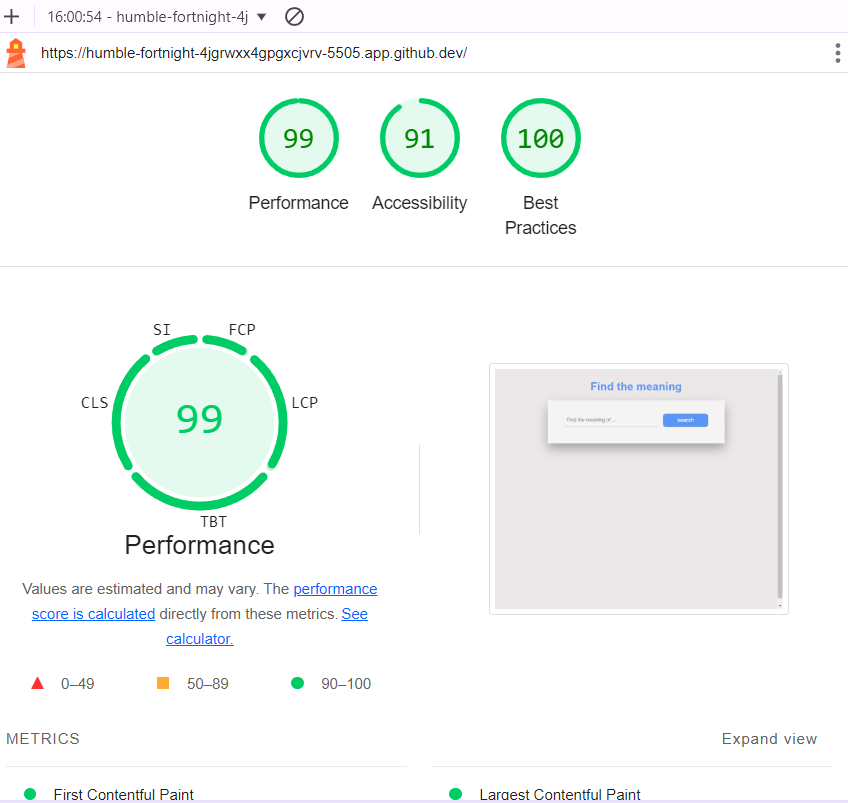

# Find the meaning

Find the meaning is a website using HTML , CSS and Javascript , where you can search for the meanings of englich words , how to pronouce them , an example using the word you are searching for , synonyms and antonyms.

To find the meaning of a word , I used javascript to communicate with a free dictionary API https://dictionaryapi.dev/ using the fetch method.

The live link can be found here :  https://sahlaouiahmed.github.io/FindTheMeaning/

## Testing:

I tried to do a lot of test to make sure everything working as expected.

1. Testing the good functioning of the site on all types of devices ( phone , tablet and desktop ).
2. Testing all images and files paths.
3. Testing the good functioning of the site on all browsers (Chrome, Firefox, Opera, Safari & Co)

To make sure that my HTML and CSS  codes contain 0 errors I used : https://validator.w3.org/ and https://jigsaw.w3.org/css-validator/

#### Validator Testing :

HTML : No errors were returned when passing through the official W3C validator https://validator.w3.org/ .
CSS : No errors were found when passing through the official Jigsaw validator https://jigsaw.w3.org/css-validator/ .
JS : Google dev tools and Python tutor to visualize the execution of my code https://pythontutor.com/visualize.html#mode=edit

#### Performance:

## Deployment :

The site was deployed to GitHub pages. The steps to deploy are as follows:
    1. In the GitHub repository, navigate to the Settings tab
    2. From the source section drop-down menu, select the Master Branch
    3. Once the master branch has been selected, the page will be automatically refreshed with a detailed ribbon display to indicate the successful deployment.
The live link can be found here - https://sahlaouiahmed.github.io/FindTheMeaning/

## Credits :

1. Instructions on how to use an API and the fetch method to communicate with it and get a response were taken from Youtube ( https://www.youtube.com/@ElzeroWebSchool ) (https://www.youtube.com/watch?v=PUkgK7TI0x0) , and https://www.w3schools.com/ .

2. Free dictionary API : https://dictionaryapi.dev/

3. The sound icon was taken from https://fontawesome.com/ .

I can develop this site in the future by adding all possible definitions , because in this project I just took the fisrt element of the data ( data [0] ) I got from the free Dictionary API.